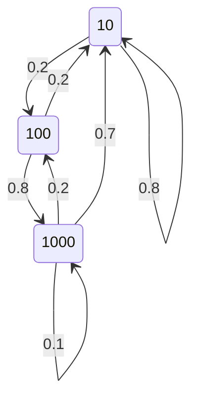

# Avaliação de Desempenho de Sistemas

## MiniProjeto DTMC - Gerador de tráfego

### Objetivos 

Consolidar o conceito de DTMC e o seu comportamento em regime transitório e estacionário usando pacotes de apoio (queueing) e simulação em Python. 

### Descrição

Considere um sistema que a cada 0,2s envia um pacote. Este pacote pode ter tamanho de 10, 100 e 1000 bytes. Após ter transmitido um pacote de 10 bytes, a probabilidade de transmitir um outro pacote de 10 bytes é de 0.8 e de transmitir um de 100 bytes é de 0.2. Se acabou de transmitir um pacote de 100 bytes então a probabilidade de transmitir um outro de 100 é ZERO, de 1000 é de 0.2 ou então transmitir o de 10. Se acabou de transmitir um pacote de 1000 bytes pode vir a transmitir um novo pacote de 1000 com probabilidade de 0.1,  um pacote de 100 com probabilidade 0.2 ou voltar a transmitir um de 10 bytes

## PARTE 1 - Uso do pacote queueing para análise.

### Questão A
- Faça um desenho da cadeia de Markov (DTMC) e mostre a matriz P.



- Matriz de transição

|      | 10  | 100 | 1000 |
|------|-----|-----|------|
| 10   | 0.8 | 0.2 | 0.0  |
| 100  | 0.2 | 0.0 | 0.8  |
| 1000 | 0.7 | 0.2 | 0.1  |

### Questão B
- Se um pacote de 1000 bytes acabou de ser transmitido, qual a probabilidade do sistema transmitir outro pacote de 100 bytes em 3 épocas para frente?

    - Resultados obtidos do código [Questão B](./parte1/questaoB.m):
  
        | 10     | 100    | 1000    |
        |--------|--------|---------|
        | 0.6870 | **0.1680** | 0.1450  |


### Questão C
- Seria possível estimar a vazão (bytes transmitidos por segundo) deste sistema? Faça uma proposta e mostre os resultados.

    - Calculamos a DTMC de longo prazo e obtivemos as seguintes probabilidades:
        
        | 10     | 100    | 1000    |
        |--------|--------|---------|
        | 0.6852 | 0.1667 | 0.1481  |

    - Multiplicando as probabilidades pela quantidade de bits trasmitidos por passo temos:

        | 10     | 100    | 1000    |
        |--------|--------|---------|
        | 6.8519 |  16.6667 |  148.1481  |

    - Multiplicamos agora pelo numero de passos, 5, temos:

        | 10     | 100    | 1000    |
        |--------|--------|---------|
        | 34.259 |   83.333  | 740.741  |

    - Somando os valores obtemos `858.33` bytes por segundo.

## PARTE 2 - Uso do simulador Python para estimar o comportamento estacionário.

- Modifique o simulador estudado em sala para confirmar a vazão estimada no item C da PARTE 1. Para ser realista (depois veremos como construir um simulador a eventos discretos), faça sleeps de 0.2s a cada transição. Colete os bytes transmitidos em runs de pelo 1000 transições. Compare com o resultado esperado na PARTE 1.

- Realizamos o experimento utilizando a função `parte2()` do código [main.py](./main.py) e obtivemos os seguintes valores:

    ```bash
    @mikeicd ➜ /workspaces/dtmf-v1 (main) $ python3 main.py
    Vazão = 858.29
    @mikeicd ➜ /workspaces/dtmf-v1 (main) $ python3 main.py
    Vazão = 863.1185
    @mikeicd ➜ /workspaces/dtmf-v1 (main) $ python3 main.py
    Vazão = 854.627
    @mikeicd ➜ /workspaces/dtmf-v1 (main) $ python3 main.py
    Vazão = 857.5745
    ```

## PARTE 3 - Estimando o tempo médio (em termos épocas) de estadia

- Faça uma modificação do simulador original (sem sleep) para computar o tempo médio de estadia (em termos de épocas) no estado transmissão de pacote de tamanho 1000. Compare com o valor teórico.  


- Realizamos o experimento utilizando a função `parte3()` do código [main.py](./main.py) e obtivemos os seguintes valores:

```
Vazão = 148.23
Tempo médio de estadia no estado de transmissão de pacote de tamanho 1000 = 0.1999999999999659 épocas

Vazão = 148.87
Tempo médio de estadia no estado de transmissão de pacote de tamanho 1000 = 0.19999999999996526 épocas

Vazão = 149.06
Tempo médio de estadia no estado de transmissão de pacote de tamanho 1000 = 0.1999999999999651 épocas
```

**Para calcular o tempo médio de estadia:**

> `Tempo médio de estadia = (Tempo no estado de transmissão de 1000) / (Taxa de saída do estado de transmissão de 1000)`

