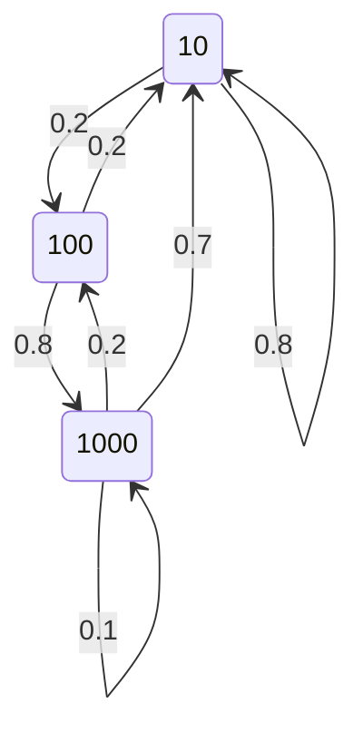

# Avaliação de Desempenho de Sistemas

## MiniProjeto DTMC - Gerador de tráfego

### Objetivos 

Consolidar o conceito de DTMC e o seu comportamento em regime transitório e estacionário usando pacotes de apoio (queueing) e simulação em Python. 

### Descrição

Considere um sistema que a cada 0,2s envia um pacote. Este pacote pode ter tamanho de 10, 100 e 1000 bytes. Após ter transmitido um pacote de 10 bytes, a probabilidade de transmitir um outro pacote de 10 bytes é de 0.8 e de transmitir um de 100 bytes é de 0.2. Se acabou de transmitir um pacote de 100 bytes então a probabilidade de transmitir um outro de 100 é ZERO, de 1000 é de 0.2 ou então transmitir o de 10. Se acabou de transmitir um pacote de 1000 bytes pode vir a transmitir um novo pacote de 1000 com probabilidade de 0.1,  um pacote de 100 com probabilidade 0.2 ou voltar a transmitir um de 10 bytes

## PARTE 1 - Uso do pacote queueing para análise.

- Faça um desenho da cadeia de Markov (DTMC) e mostre a matriz P.

- Matriz de transição

|      | 10  | 100 | 1000 |
|------|-----|-----|------|
| 10   | 0.8 | 0.2 | 0.0  |
| 100  | 0.2 | 0.0 | 0.8  |
| 1000 | 0.7 | 0.2 | 0.1  |

- Se um pacote de 1000 bytes acabou de ser transmitido, qual a probabilidade do sistema transmitir outro pacote de 100 bytes em 3 épocas para frente?

- Seria possível estimar a vazão (bytes transmitidos por segundo) deste sistema? Faça uma proposta e mostre os resultados.

## PARTE 2 - Uso do simulador Python para estimar o comportamento estacionário.

- Modifique o simulador estudado em sala para confirmar a vazão estimada no item C da PARTE 1. Para ser realista (depois veremos como construir um simulador a eventos discretos), faça sleeps de 0.2s a cada transição. Colete os bytes transmitidos em runs de pelo 1000 transições. Compare com o resultado esperado na PARTE 1.

## PARTE 3 - Estimando o tempo médio (em termos épocas) de estadia

- Faça uma modificação do simulador original (sem sleep) para computar o tempo médio de estadia (em termos de épocas) no estado transmissão de pacote de tamanho 1000. Compare com o valor teórico.  

